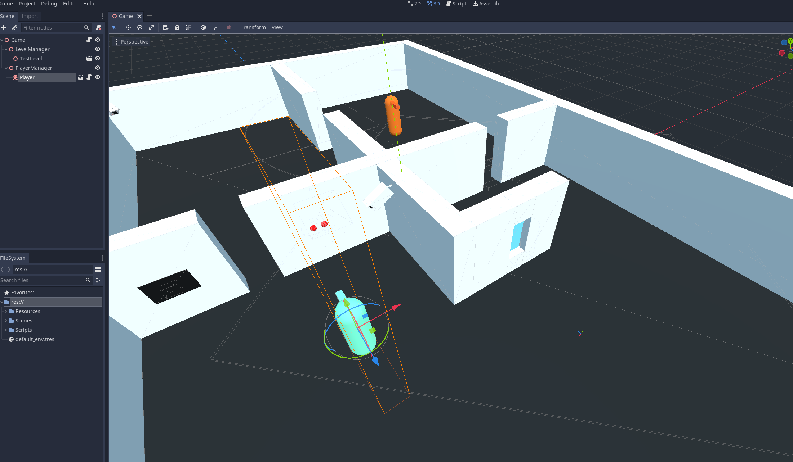

# StealthGameBase
A framework for a stealth game.

Take/use/share what you want/need.
No attribution required.

Requires Mono (C#) version of the Godot engine.

Contains security camera screens. (interact to swap between security cameras)
Enemy "AI" (Line of sight, sound detection).
Simple player controller.
Interactable objects with inheritance.

